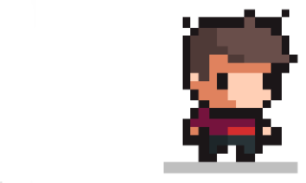
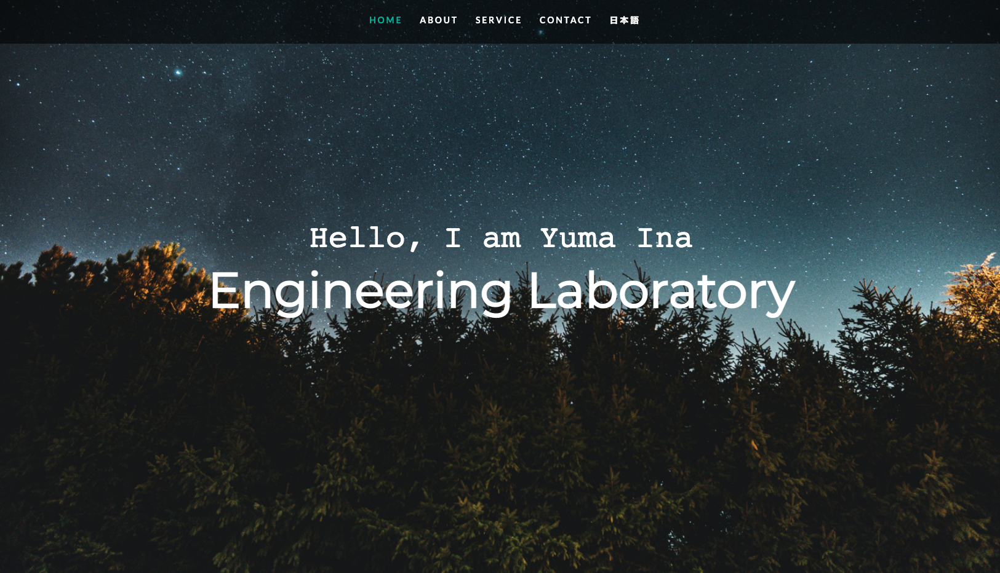
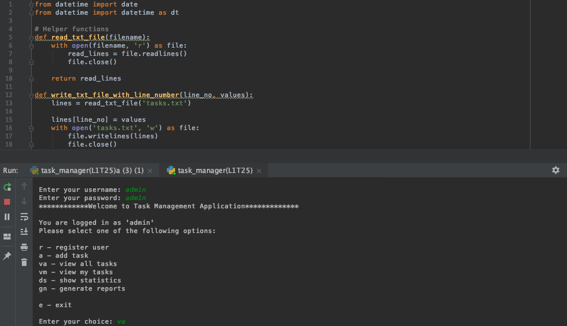
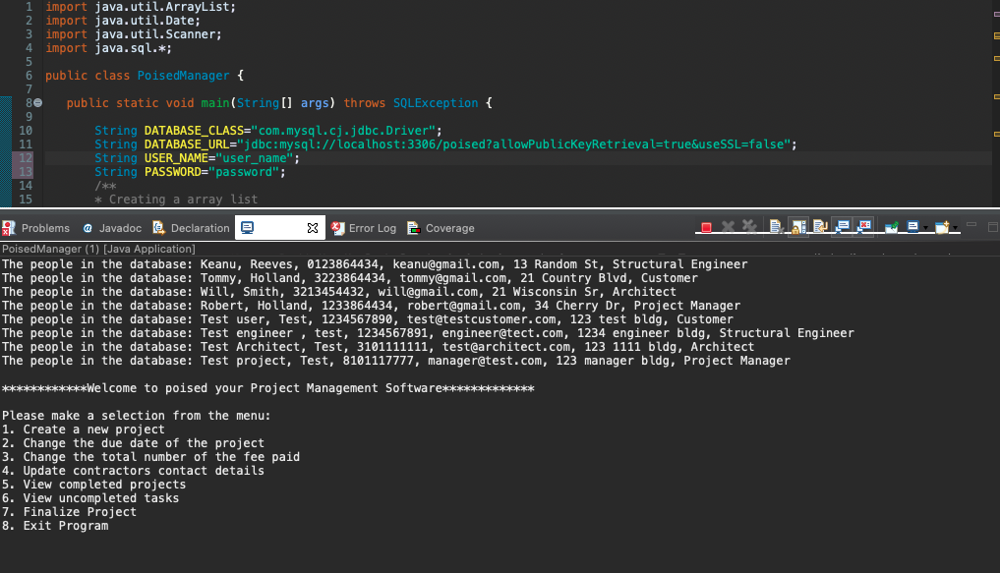

<!DOCTYPE html>
<html lang="en">
<head>
  <title>Portfolio</title>
  <meta charset="utf-8">
  <meta name="viewport" content="width=device-width, initial-scale=1">

   <link rel="stylesheet" href="bootstrap.min.css"/>
   
    <link rel="stylesheet" href="https://use.fontawesome.com/releases/v5.7.0/css/all.css" integrity="sha384-lZN37f5QGtY3VHgisS14W3ExzMWZxybE1SJSEsQp9S+oqd12jhcu+A56Ebc1zFSJ"
      crossorigin="anonymous"/>
    <link rel="stylesheet" type="text/css" href="style.css" />

</head>
<body data-spy="scroll" data-target="#navbarResponsive">
  

    <!----------------Navigation Start----------------->
    <nav class="navbar navbar-expand-md navbar-dark bg-dark fixed-top">
      <button class="navbar-toggler" type="button" data-toggle="collapse" data-target="#navbarResponsive">
        
      </button>

      

        <ul class="navbar-nav mx-auto">
          <li class="nav-item">
            <a class="nav-link" href="#home">Home</a>
          </li>
          <li class="nav-item">
            <a class="nav-link" href="#about">About</a>
          </li>
          <li class="nav-item">
            <a class="nav-link" href="#service">Projects</a>
          </li>
          <li class="nav-item">
            <a class="nav-link" href="#contact">Contact</a>
          </li>
          <li class="nav-item">
            <a class="nav-link" href="">日本語</a>
          </li>
         
        </ul>
        
      

    </nav>
    <!----------------Navigation End----------------->
    <!----------------Background Start----------------->
    

      
    

    

      <h5>Hello, this is Yuma Ina's</h5>
      <h1>Engineering Laboratory</h1>
    

    <!----------------Background End----------------->
  

  <!----------------About Start----------------->
  

    

      <h3 class="display-4 font-weight-bold">About Me</h3>
      

    

    

      

        
      

      

        
I love programming, learning, and traveling. I have been working full-time at one of the American job search engine companies in Tokyo. Working in tech ignited my passion for coding. I am expecting to complete coding bootcamp in March 2021 and switch careers into a software engineer.

        
Completed courses: <a href="https://www.hyperiondev.com/portfolio/31143/">https://www.hyperiondev.com/portfolio/31143/</a>

        
Skils: Python / Java / SQL / HTML / CSS / jQuery / Git / Docker

      

      
    

  

  <!----------------About End----------------->

   <!----------------Service Start----------------->
  

    

      <h3 class="display-4 font-weight-bold">My Projects</h3>
      

    

    

      

        

        
        

          <h5 class="card-title">My Portfolio Site</h5>
          
This one-page portfolio site was developed to share what I have learned through my coding journey.

          
Languages: HTML / CSS / Bootstrap / jQuery

          <a href="https://github.com/yuma3496/portfolio_site" class="btn btn-dark">Git Hub</a>
        

      

      

      
      

        

        
        

          <h5 class="card-title">Task Management System</h5>
          
This system is designed to assist a small business in managing tasks assigned to each member of a team. This includes creating, storing, displaying and editing tasks and related information. 

          
Languages: Python

          <a href="https://github.com/yuma3496/task_management" class="btn btn-dark">Git Hub</a>
        

      

      

      

        

        
        

          <h5 class="card-title">Project Management Software</h5>
          
This software can be used for a small structural engineering firm. This allows you to manage various projects and handle information about customers, total fee, deadline, etc. in the database. An invoice is generated for the client when a project is marked as "finalized".

          
Languages: Java / SQL(MySQL)

          <a href="https://github.com/yuma3496/projectManagementSoftware" class="btn btn-dark">Git Hub</a>
        

      

      

    

  

 <!----------------Modal Start----------------->
 

  

    

      
  

  <!----------------Modal End----------------->

  <!----------------Service End----------------->

  <!----------------Contact Start----------------->
  

    

      <h3 class="display-4 font-weight-bold">Contact Me</h3>
      

    

    <form action="/action_page.php">
      

        <label for="email">Full Name:</label>
        <input type="text" class="form-control" id="email">
      

      

        <label for="email">Email address:</label>
        <input type="email" class="form-control" id="email">
      

      

        <label for="email">Your Message:</label>
        <textarea class="form-control"></textarea>
      

      <button type="submit" class="btn btn-dark">Sent</button>
    </form>

  

  <!----------------Contact End----------------->

  <!----------------Footer Start----------------->
  <footer class="bg-light text-center text-lg-start">
    <!-- Copyright -->
    

      
© 2021 Copyright: Yuma Ina

    

    <!-- Copyright -->
  </footer>
  <!----------------Footer End----------------->

    <!-- jQuery / Popper.js, / Bootstrap JS -->
    
    <!----------------<Footer End----------------->
    
    
    

</body>
</html>
